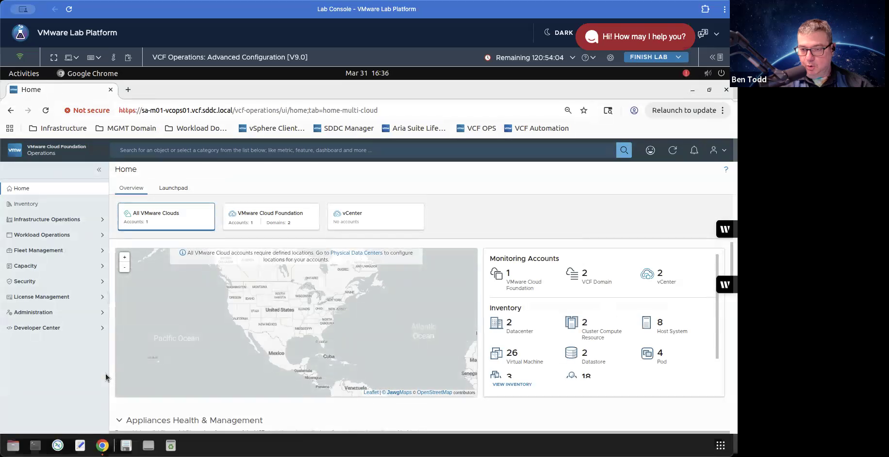
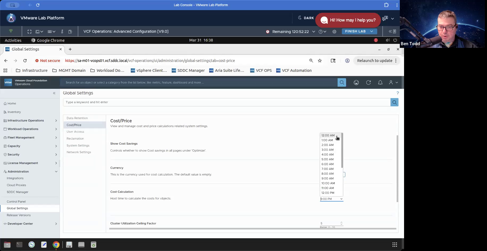

# Transcript: GMT20260331-233449_Recording_1832x944.mp4

**Duration:** 00:03:53  
**Keywords:** unicorn  
**Screenshots:** 5  

---

**[00:00:04]** Lab 3. Configuring Cost Management
**[00:00:14]** Objective and Tasks
**[00:00:16]** Configure cost management settings in the VCF Operations Console and review the cost dashboards.
**[00:00:26]** Review the currency and cost calculation settings.
**[00:00:29]** Configure cost drivers.
**[00:00:32]** Run a cost calculation.
**[00:00:35]** Review the showback dashboard.
**[00:00:37]** dashboard, create and view cost analysis. Task one, review the currency and cost calculation
**[00:00:49]** settings. Here are the steps. To review the currency unit and the cost calculation time
**[00:00:59]** for your VCF operations console, in Chrome, log in to the VCF operations UI using admin
**[00:01:11]** admin as the password, sorry, using admin as a username, password, VMware, 123, exclamation point,
**[00:01:22]** VMware, 123, exclamation. Click login. Unicorn. Click administration. Click global settings.

> **[00:01:41] Keyword: "unicorn"**

**[00:01:55]** settings, Unicorn, Unicorn. From the global settings pane, select cost price. Review the

> **[00:02:19] Keyword: "unicorn"**

> **[00:02:23] Keyword: "unicorn"**

**[00:02:40]** currency setting. It should already be set to US dollar. Verify that the cost calculation
**[00:02:49]** feature is activated by default and the host time to calculate the cost for objects setting
**[00:02:56]** is set to 9 p.m. Click the 9 p.m. time drop-down menu and select 12 a.m.
**[00:03:09]** Unicorn. Unicorn. Click Save. The automatic cost calculation is activated and set to

> **[00:03:09] Keyword: "unicorn"**

> **[00:03:24] Keyword: "unicorn"**

**[00:03:40]** execute at 12 a.m. daily.